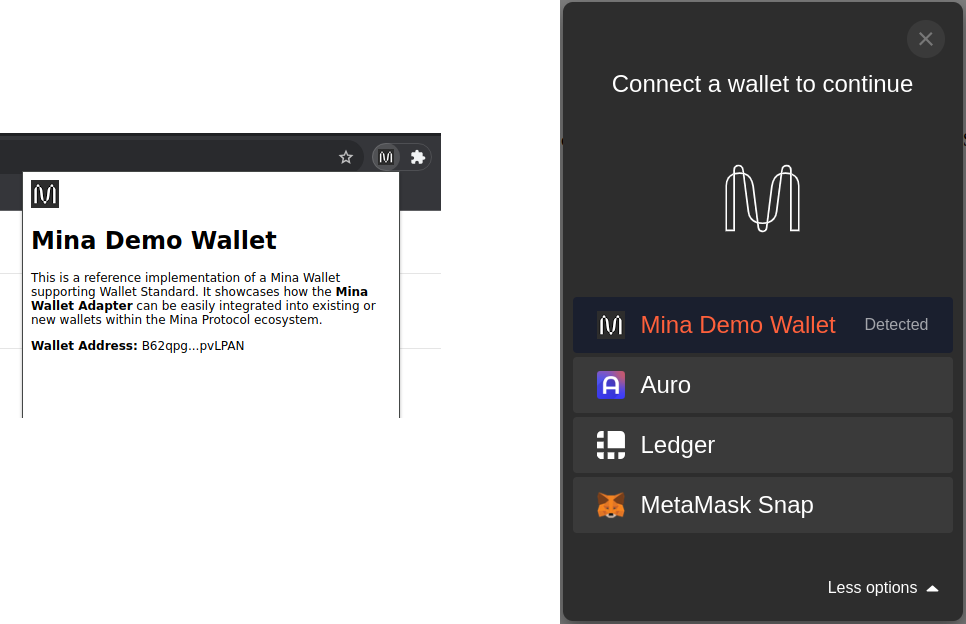

# Mina Demo Wallet

A reference implementation of a Mina browser extension wallet supporting [Wallet Standard](https://github.com/mina-wallet-adapter/wallet-standard). It showcases how the [Mina Wallet Adapter](https://github.com/mina-wallet-adapter/wallet-adapter) can be easily integrated into existing or new wallets within the Mina Protocol ecosystem.



## How to build

1. Clone this git repository and change to the project directory

```bash
git clone https://github.com/mina-wallet-adapter/demo-wallet.git
cd demo-wallet
```

2. Install the dependencies

```bash
npm install
```

3. For local development, start a development server.

```bash
npm run dev
```

4. To create a production version of the extension, run build.

```bash
npm run build
```

## How to test

You can preview the production build on any Chromium-powered browser like Chrome, Edge, Brave, etc.

- Go to `chrome://extensions`
- Enable developer mode by clicking the toggle switch in the top-right corner
- Drag the `build` directory into the window
- Chrome will load the extension, and you should see `Mina Demo Wallet` listed in the extensions menu.
